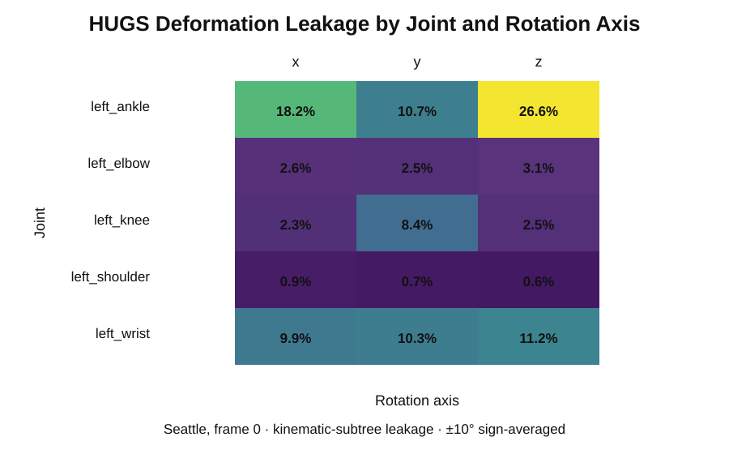
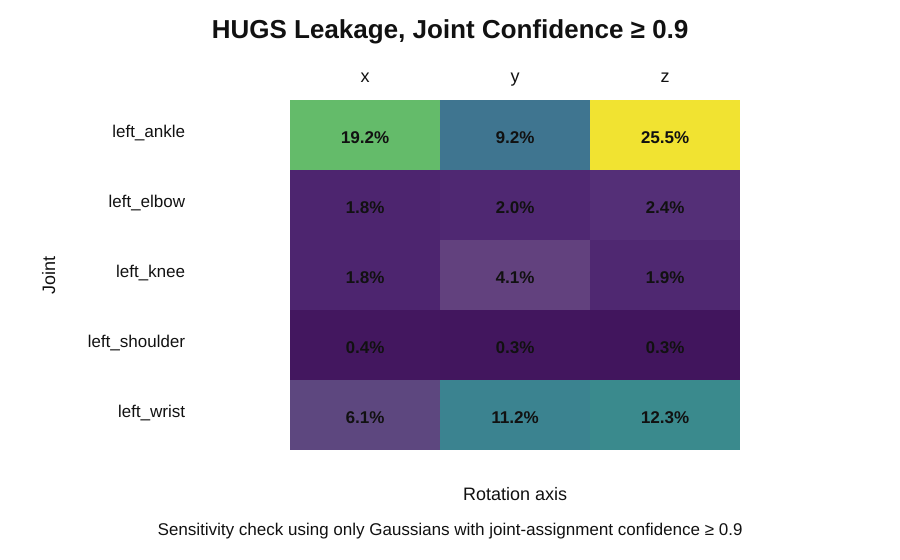
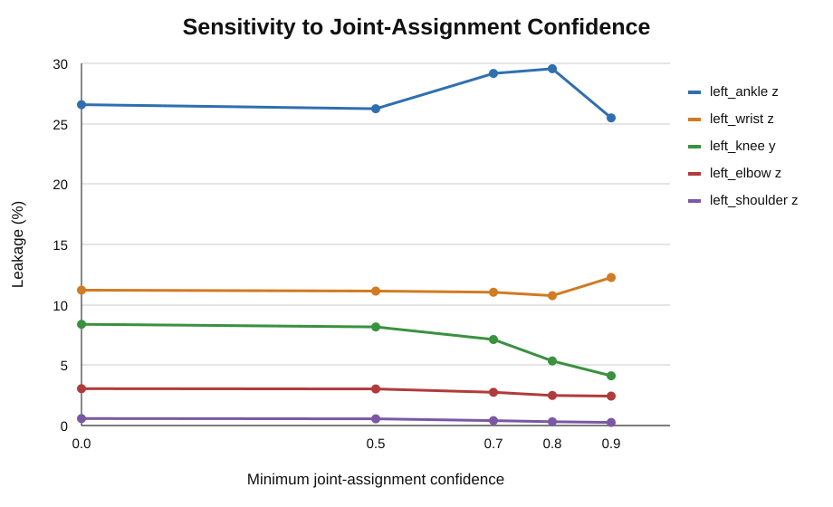
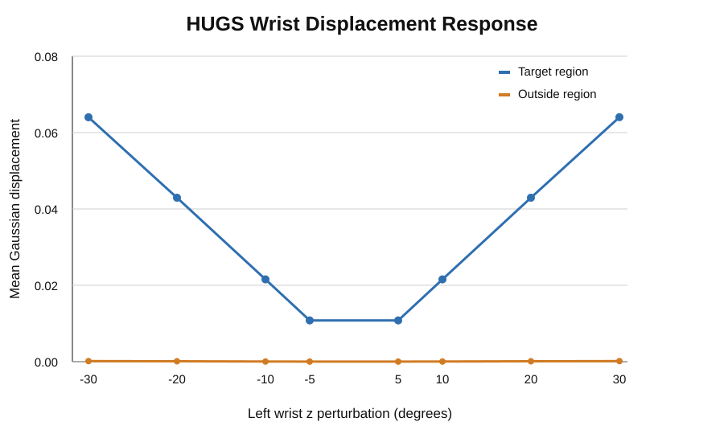
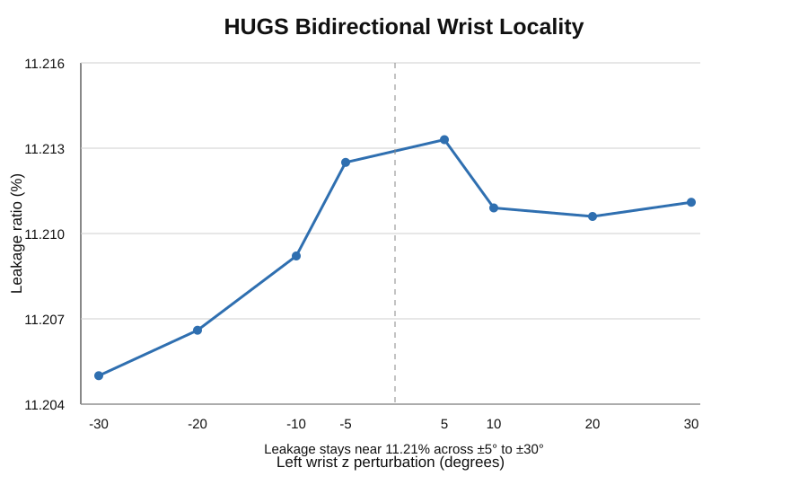

# 2026-09-13 — HUGS Baseline v1

## Research question

How local is local control in an existing real-time Gaussian human representation?

## What was completed

A controlled deformation-locality baseline was completed on pretrained HUGS using the NeuMan Seattle sequence, frame 0.

- 36 saved probe measurements
- 472,958 human Gaussians
- left-wrist magnitude/sign sweep
- x/y/z axis comparison
- left wrist, elbow, shoulder, knee, and ankle joint sweep
- kinematic-subtree leakage re-analysis
- joint-assignment confidence sensitivity analysis
- large raw NPZ outputs archived in Google Drive

## Key measured observations

- left ankle z leakage: 26.57%
- left ankle x leakage: 18.19%
- left wrist z leakage: 11.21%
- left wrist y leakage: 10.27%
- left wrist x leakage: 9.90%
- left shoulder x/y/z leakage: 0.91% / 0.66% / 0.58%

The distal-versus-proximal pattern remains visible after high-confidence filtering. Wrist z leakage remains approximately stable across the tested signed magnitude sweep.

These are baseline observations for one sequence and one frame, not a general claim about HUGS.

## Tables

- [Joint × axis leakage](../../experiments/01-baseline/analysis/joint_axis_leakage.csv)
- [Confidence sensitivity](../../experiments/01-baseline/analysis/confidence_sensitivity.csv)
- [Joint assignment counts](../../experiments/01-baseline/analysis/joint_assignment_counts.csv)

## Figures

### Joint × axis leakage



### High-confidence leakage



### Confidence sensitivity



### Wrist displacement response



### Wrist bidirectional leakage



## Raw data

Authoritative large NPZ arrays are stored in Google Drive under:

```text
/content/drive/MyDrive/interactive-digital-humans/experiments/01-baseline/
```

See [DATA_MANIFEST.md](../../experiments/01-baseline/DATA_MANIFEST.md) for the exact archive structure and provenance policy.

## Interpretation at end of day

The strongest current signal is articulation dependence. Distal joints, especially the ankle and wrist in this frame, show substantially more non-target displacement than the shoulder. The next defensible step is to spatially localize the highest-leakage Gaussians and examine whether their behavior is explained by expected LBS influence, semantic assignment boundaries, or another representation-level mechanism.

## Next step

Spatial Leakage Localization: visualize and characterize where the ankle, wrist, and shoulder leakage actually occurs in 3D Gaussian space.
